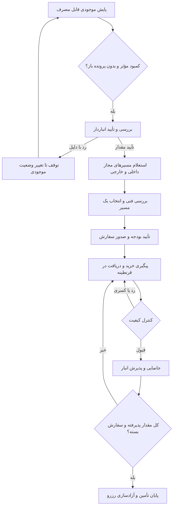

# پایلوت پیگیری فعال تأمین در هم‌نفس

این نسخه فقط پایلوت کمبود مواد را به پایش فعال وصل می‌کند. گردش‌های تولید، فروش، خدمات، تدارکات و پیام‌ها همچنان منطق و کارتابل فعلی خود را دارند؛ تبدیل همه آن‌ها به همین سیاست مرحله‌ای موضوع توسعه بعدی است.

## فعال‌سازی

۱. در «کاربران و دسترسی‌ها» مجوزهای واقعی و حساب‌های فعال را تعیین کنید.
۲. وارد «برنامه تأمین» شوید؛ در ابتدای فهرست، «پایش کسری و پیگیری تأمین» و تنظیمات آن قرار دارد.
۳. برای هر نقش یک مسئول و برای تأخیرها یک سرپرست انتخاب کنید. مسئول انبار باید نقش تأمین انبار، نقش گردش مواد انبار و دسترسی انبار خام و قرنطینه داشته باشد. کنترل کیفیت به نقش QC گردش مواد نیاز دارد. مدیر بودن به‌تنهایی جای سمت عملیاتی عضو را نمی‌گیرد.
۴. برای مواد، حد سفارش/موجودی هدف و مسیرهای مجاز استعلام را تعریف کنید. تعیین مسیر از وظایف فنی در بخش تأمین است.
۵. روزهای کاری، ساعت تهران، تعطیلات و مهلت‌ها را تنظیم کنید. تعطیلات خودکار تقویمی وارد نشده‌اند؛ تعطیلات شرکت را در انتخابگر شمسی اضافه کنید.
۶. فعال‌سازی را تیک بزنید و ذخیره کنید؛ سپس «پایش همین حالا» را بزنید. پیش‌فرض عمداً غیرفعال است؛ نرم‌افزار مسئول فرضی نمی‌سازد.

| تنظیم | پیش‌فرض | رفتار |
|---|---|---|
| روز و شیفت | شنبه تا چهارشنبه، ۸ تا ۱۷ تهران | مهلت‌ها بر اساس دقیقه کاری |
| مهلت عادی | ۴۸۰ دقیقه کاری | برای هر مرحله جدید |
| مهلت موجودی آزاد صفر | ۶۰ دقیقه کاری | اولویت فوری پرونده هنگام ایجاد |
| یادآوری تأخیر | هر ۱۲۰ دقیقه کاری | یک اعلان در هر بازه؛ نه در هر اجرای زمان‌بند |
| ارجاع به سرپرست | ۱۲۰ دقیقه کاری پس از موعد | یک ارجاع برای هر سررسید |
| پایان شیفت | ۱۵ دقیقه آخر | اعلان جدا برای هر کار باز؛ بدون ثبت تکمیل خودکار |
| افق سفارش در راه | ۷ روز تقویمی | فقط سفارش آزاد دارای ETA معتبر در این افق |

تنظیم مهلت و تقویم جدید به مراحل بعدی اعمال می‌شود؛ مهلت کار باز بی‌صدا تغییر نمی‌کند. سرپرست می‌تواند مهلت همان کار را با ثبت دلیل تمدید کند. تغییر مسئول موجب ارجاع مرحله به مسئول جدید می‌شود. مسئول ثبت‌شده روی محموله در QC و جانمایی بر مسئول عمومی مقدم است؛ مسئول نامعتبر با عنوان «مسئول تعیین نشده» به سرپرست ارجاع می‌شود.

## راه‌اندازی اجرای مستقل روی سرور

- از زمان‌بند سیستم‌عامل/هاست، هر پنج دقیقه `node scripts/run-duty-scheduler.mjs` را اجرا کنید.
- `DUTY_SITE_URL` آدرس HTTPS همان نصب، مثلاً دامنه شرکت است.
- `TASK_SCHEDULER_TOKEN` را به‌صورت یک راز تصادفی قوی در محیط برنامه و محیط زمان‌بند با مقدار یکسان تنظیم کنید؛ آن را در مخزن، گفتگو یا فایل خروجی نگذارید.
- زمان‌بند از `POST /api/tasks/tick` استفاده می‌کند. توکن اشتباه 401 می‌دهد و اجرای ناموفق باید در مانیتورینگ سرور دیده شود.
- زمان آخرین اجرای موفق پس‌زمینه در بخش پایش نمایش داده می‌شود. بیش از ۱۵ دقیقه بدون موفقیت، هشدار وضعیت ایجاد می‌کند. بررسی هنگام بازبودن صفحه جای اجرای مستقل را نمی‌گیرد.
- اعلان‌ها در کارتابل ذخیره می‌شوند؛ ارسال پیامک، ایمیل یا اعلان سیستم‌عامل گوشی در این تغییر اضافه نشده است. برای جمع‌بندی پایان روز باید حداقل یک tick در ۱۵ دقیقه آخر شیفت اجرا شود؛ backfill گزارش روزانه در این نسخه وجود ندارد.

پوش کد روی GitHub به‌تنهایی برنامه یا زمان‌بند سرور شرکت را به‌روزرسانی نمی‌کند. این شاخه TypeScript/Cloudflare است؛ شاخه `main` پروژه جداگانه .NET 8 است.

## محاسبه و کنترل داده

- موجودی قابل‌مصرف فقط بچ تأییدشده و منقضی‌نشده در انبار خام/خط است. رزروهای تأمین و نیاز تولید از آن کسر می‌شوند.
- خرید صادرشده/پرداخت‌شده/درحال‌آماده‌سازی/ارسال‌شده، فقط به میزان آزاد تخصیص‌نیافته و در افق زمانی، به پوشش آینده افزوده می‌شود. سفارش پیشنهادی یا لغوشده پوشش نیست.
- موجودی قرنطینه جدا نمایش داده می‌شود؛ تا QC و جانمایی موجودی قابل‌مصرف نیست.
- برای هر ماده فقط یک پرونده خودکار باز ایجاد می‌شود؛ درخواست دستی باز یا برنامه تولید فعال که همان ماده را می‌خواهد نیز جلوی ایجاد خرید موازی را می‌گیرد و در UI مانع را توضیح می‌دهد. افزایش مقدار آن پرونده به‌صورت خودکار انجام نمی‌شود و نیاز به بررسی مسئول دارد.
- انباردار هنگام تأیید، موجودی جاری را دوباره محاسبه می‌کند. تأیید بیش از پیشنهاد به دلیل روشن نیاز دارد. نیاز ردشده با همان وضعیت بی‌وقفه باز نمی‌شود؛ تغییر موجودی/حد سفارش موجب بررسی دوباره می‌شود.
- RFQ هر دو مسیر خرید نیست. انتخاب مسیر، صلاحیت فنی، بودجه و عملیات خرید همان کنترل‌های تأمین موجود را دارند.
- دریافت ناقص، QC مردود یا قبول بدون جانمایی، پایان تأمین را مجاز نمی‌کند. تکمیل فقط رزرو را آزاد می‌کند و رسید یا موجودی دوباره نمی‌سازد.
- مبلغ و نیاز خرید را LLM از خودش تولید نمی‌کند؛ محاسبه و تغییر وضعیت در handler قطعی سرور انجام می‌شود.

## تعامل دستیار

اعلان کارتابل مهم‌ترین وظیفه تأمین کاربر را پیشنهاد می‌دهد. کاربر با بازکردن دستیار، درخواست مرتبط با شناسه همان وظیفه/پرونده را آماده می‌کند؛ دستیار یکی‌یکی اطلاعات لازم را می‌پرسد. پاسخ، مانع و درخواست تمدید قابل ثبت است. فرمان تغییر داده همچنان با تأیید کاربر و بررسی مجدد دسترسی اجرا می‌شود. پاسخ «انجام شد» به‌تنهایی گردش واقعی را نمی‌بندد.

ابزارهای جدید MCP: `get_replenishment_status`، `scan_replenishment`، `configure_replenishment`، `confirm_stock_shortage`، `reject_stock_shortage`، `finish_replenishment`. خرید، QC، دریافت و وظایف از ابزارهای قبلی و همان handlerهای HTTP استفاده می‌کنند. ابزارهای تنظیم/پایش دستی فقط مدیر؛ تأیید موجودی و پایان تأمین فقط نقش انبار مجاز.

## نگهداری و تست

جدول یا migration جدید لازم نیست. داده‌های `replenishment_policy` و `workflow_health` و پرونده‌های تأمین در `flow_entities` و وظایف/اعلان‌ها در جداول موجود هستند. freeze عمومی migration 0016، پشتیبان، تراکنش حذف و هر دو محدوده reset آن‌ها را پوشش می‌دهند. پس از reset، پایش به حالت غیرفعال برمی‌گردد و باید دوباره تنظیم شود.

تست‌ها: `node tests/replenishment.cjs`، `node tests/sourcing.cjs`، `node tests/system-reset.cjs`، `node tests/assistant.cjs`، `node tests/mcp-integration.cjs` و TypeScript/build. تست‌ها با پایگاه SQLite موقت اجرا می‌شوند؛ reset واقعی روی نصب شرکت انجام نمی‌شود. تست ورود و UI واقعی سرور شرکت نیاز به نصب همان نسخه روی آن سرور دارد.
